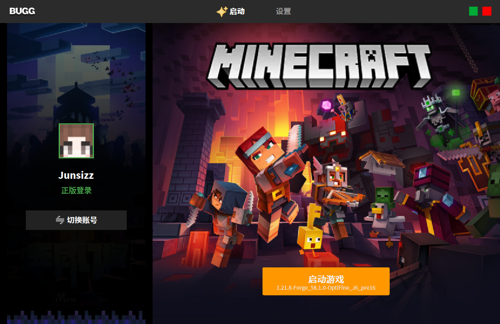

# 🎮 Bugg Minecraft Launcher 启动器

[](LICENSE)
[](./COMMUNITY_LICENSE.md)

[](https://github.com/vdjango/buggcraft/commits/main)
[](https://github.com/vdjango/buggcraft/issues)
[](https://github.com/vdjango/buggcraft)
[](https://www.python.org/)
[](https://github.com/vdjango/buggcraft/releases)

**buggcraft Launcher 启动器，我们的目标是提供一个全新的选择**。​​ 我们希望在强大功能的基础上，**在​​设计美学、联机体验、开源理念​​上做出特色**，为那些看重这些特质的玩家和贡献者提供一个 “由热爱驱动” 的家园。我们相信，游戏体验应从启动那一刻就充满愉悦与期待，因此决心构建一款**​​免费、开放、以用户体验 为核心​​的 Minecraft Launcher 启动器**





虽然市面上已有功能强大的启动器，也存在 ​​Lunar Client​​ 等专注于特定场景（如PVP优化）的启动器
，但我们的项目旨在探索一条**​​不同的路径**​​，专注于解决一些**我们认为尚未被完美满足的核心体验**：

* **​​追求极致的用户体验与视觉设计​​：** 我们希望提供一种​​更现代、更直观、更愉悦​​的用户交互体验。我们相信，启动器不仅是功能工具，更应是玩家进入游戏世界的优雅门户。
* **​​构建无缝联机生态的愿景​​：** 游戏的联机功能依赖复杂的第三方工具或手动配置。我们的目标是​​深度集成​​联机大厅与FRP内网穿透功能，极大降低好友之间联机的技术和操作门槛，让连接变得更简单、更稳定。
* **​​坚守开源与社区驱动的纯粹性​​：** 我们选择以开源（AGPLv3协议）的方式运作，是为了确保项目的​​透明性、可信任度和可持续的社区共建​​。其初衷是防止大公司闭源滥用，并鼓励所有商业使用都能回馈社区，守护玩家免费的权益，而非追求个人商业利益。
* **​​关注细节与性能​​：** 从设计之初，我们就注重性能优化，力求在提供丰富功能的同时，保持应用的轻量与流畅，确保在各种设备上都能拥有良好的使用体验。

**​​简而言之，我们的目标是提供一个全新的选择**。​​ 我们希望在强大功能的基础上，在​​设计美学、联机体验、开源理念​​上做出特色，为那些看重这些特质的玩家和贡献者提供一个 **“由热爱驱动”** 的家园。我们相信，游戏体验应从启动那一刻就充满愉悦与期待，因此决心构建一款​ **​免费、开放、以用户体验** 为核心​​的启动器

> “尽管现有启动器提供了强大的功能，但我们发现玩家在无缝联机、​​视觉体验​​等方面仍有更深层的期待。本项目旨在弥补这些缺口，致力于打造一款设计符合我的世界、联机便捷、并以开源社区为核心的全新启动器。我们尊重所有为Minecraft社区做出贡献的项目，并希望以我们的方式，为这个生态增添一份独特的选择。”

## 🚀 关于体积优化

在采用 Python 与 PySide6 进行开发时，通常生成的可执行文件体积较为庞大（初始打包体积达 300MB），其中包含 Python 解释器、Qt 框架库以及各种依赖项。我们通过一系列**​​深入的优化策略**​​​，成功将最终分发体积压缩至约 **13.6 MB (14,309,888 字节)** 显著提升了**分发效率和用户体验**。


## ✨ 特性概览

|功能类别|特性|状态|时间|
|-|-|-|-|
|🔐 账户管理​|Microsoft 正版登录|完成|2025-09-06|
| |获取正版账户头像|完成|2025-09-07|
| |正版登录令牌自动续期|🚧 开发中|-|
| |离线模式登录|完成|2025-09-06|
| |第三方外置登录|待开发| |
| |角色切换|完成|2025-09-07|
|🎮 游戏核心​|游戏启动|完成|2025-09-06|
| ​|全局设置|完成|2025-09-10|
| ​|多版本管理|待开发| |
| |版本隔离设置|待开发| |
|📚 程序页面布局|游戏启动页|完成|2025-09-06|
| ​|Mini版启动器|待开发|-|
| |游戏全局设置|🚧 待优化|2025-09-10|
| ​|多版本管理|待开发| |
| |版本隔离设置|待开发| |
|🌐 联机功能​|局域网游戏发现|待开发| |
| |集成内网穿透|待开发| |
| |客户端资源共享|待开发| |
| |房间管理与密码保护|待开发| |
|🌐 联机服务端​|内网穿透|待开发| |
|✨ UI 设计​|登录首页|完成|2025-09-05|
| ​|Mini版启动器|🚧 设计中|-|
| ​|联机大厅|完成|2025-09-07|
| ​|全局设置|完成|2025-09-07|
| ​|多版本管理|待设计| |
| |版本隔离设置|待设计| |
| |下载|🚧 设计中|-|
| |更多|完成|2025-09-07|
|⚙️ 性能与优化​|体积优化 (200MB+ → ~13MB)​|完成|2025-09-11|
| |轻量级网络库 (替代requests)​|完成|2025-09-11|
| |PySide6/Qt模块化裁剪​|完成|2025-09-11|
| |资源文件压缩​|完成|2025-09-11|
| |资源文件及库文件托管下载与动态加载​|完成|2025-09-11|
| |日志记录|完成|2025-09-11|

## 📖 详细功能说明


*🔐 账户管理*

* ​正版登录​​: 安全便捷地通过 Microsoft 官方流程登录，获取您的正版账户。
* ​​离线模式​​: 无需正版账户，快速创建离线角色进行游戏。
* ​​多账户切换​​: 轻松管理多个 Minecraft 账户，并在它们之间快速切换。
* ​​令牌管理​​: 启动器会自动管理您的登录会话。令牌过期后，启动器会提示您重新登录，​​但已启动的游戏不会受到影响​​。未来版本将探索自动续期功能。

*🎮 游戏核心*

* ​​版本选择​​: 下载并管理多个 Minecraft 游戏版本（Vanilla, Forge, Fabric 等），并轻松切换。
* ​​版本隔离​​: 为不同的游戏版本创建独立的配置、资源文件和模组文件夹，避免冲突。
* ​​全局设置​​: 统一配置默认的窗口大小、Java 路径、内存分配等参数。
* ​​版本特定设置​​: 为每个游戏版本单独覆盖全局设置，满足个性化需求。

*⚙️ 设置详解*

在“设置”或“全局设置”中，您可以配置：

* ​​启动器可见性​​: 控制游戏启动后启动器的行为（保持、最小化、隐藏）。
* 进程优先级
* ​​窗口设置​​: 设置游戏启动时的窗口尺寸和是否全屏。
* ​游戏 Java​​: 选择不同版本的 Java 虚拟机。
* ​​游戏内存​​: 通过滑块直观分配最大和最小内存。
* ​​JVM 参数​​: 高级用户可自定义虚拟机启动参数。
* 显卡支持


*🌐 联机大厅 (开发中)*

我们正在构建一个无缝的联机体验，旨在让您和好友的连接从未如此简单：

* ​*​局域网发现​​:* 自动发现同一局域网内其他正在运行的游戏，实现零配置联机。
* ​​​*​互联网联机​​:​* 无需复杂的网络知识。启动器将​​集成内网穿透功能​​，只需一个按钮，即可将您的游戏开放给互联网上的好友。
* ​​​*​社区服务器​​:​* 社区爱好者可以基于本项目轻松架设公共联机服务器，并将其地址添加到启动器的“源列表”中。玩家可以发现并加入这些公共服务器进行游戏。
* ​​​*​客户端共享​​:​* 为解决模组联机时版本不一致的痛点，房间主机可以上传所需的客户端配置，好友可一键下载并启动，确保模组环境完全一致。
* ​​​*​房间管理​​:​* 创建私有房间并设置密码，或通过未来的“房间号”功能快速加入特定游戏。


## 🚀 快速开始

**环境准备**
确保您的系统已安装：

* ​​Python​​: 版本 3.8 或更高。从 Python 官网下载。
* ​​Git​​: 用于克隆项目。

**安装与运行**

1. ⏱️ 克隆项目​​:

```bash
git clone get@github.com:vdjango/buggcraft.git
cd buggcraft
```

2. ​🧑‍💻 ​安装依赖​​:

```bash
# 推荐使用虚拟环境
python -m venv venv
# 激活虚拟环境
# On Windows: venv\Scripts\activate
# On macOS/Linux: source venv/bin/activate
pip install -r requirements.txt
```

3. ​🤖 ​运行启动器

```bash
python main.py
```


**🛠️ 开发与构建**

（此部分面向可能想要贡献代码的开发者）

本项目使用 PySide6 构建用户界面。如果您想从源代码构建或参与开发：

1. 确保安装了所有开发依赖 (pip install -r requirements-dev.txt)。
2. 代码结构遵循 PEP 8风格指南。
3. 我们欢迎 Pull Requests！请在提交前确保代码通过所有测试。

## 贡献

**🤝 如何贡献**

我们欢迎所有形式的贡献！

* ​​报告 Bug​​: 在 GitHub Issues提交问题，请详细描述问题现象和复现步骤。
* ​​提出新功能​​: 在 Issues 中分享你的想法。
* ​​提交代码​​: Fork 本项目，创建特性分支，提交你的更改并发起 Pull Request。

详细的贡献指南请参阅 CONTRIBUTING.md。

**💴 赞助**

https://afdian.com/a/buggicu


## ⚖️ 许可模式与社区倡议

首先，感谢您关注本项目！在下载和使用之前，我们希望占用您几分钟时间，真诚地向您说明我们的初衷和规则。这一切都是为了守护一个纯粹由热爱驱动的游戏环境。

### 🛡️ 我们的初心与愿景

我们坚信，游戏的乐趣源于连接与分享，不应被商业利益所绑架。本项目的核心目标，是为所有《我的世界》玩家创建一个**永久免费、开放、稳定**的联机家园。

*   **对玩家：** 我们开发者郑重承诺，**绝不会就软件本身的使用向您收取任何费用**。您的快乐是我们的唯一目标。
*   **对社区：** 我们鼓励学习、交流和基于爱好的开发。所有个人和非营利使用都将得到我们的大力支持。

### ⚖️ 为何需要规则？

一个现实的风险是：个别商业实体可能会无偿使用我们倾注心血的代码，将其包装成​​付费服务​​，这不仅损害了玩家的利益，也践踏了开源共享的精神。

**因此，我们并非要“禁止商业”，而是倡导“负责任地商业”：​​**

我们要求从本项目中获利的商业公司，必须回馈社区，以此形成一个​​良性的循环​​，而非单方面的索取。这本质上是“取之于社区，用之于社区”。


### 📜 清晰的许可模式

为确保上述理念，我们采用了以下经过深思熟虑的许可模式：

1.  **对于社区用户 (您！):**
    *   本项目基于 **GNU Affero 通用公共许可证 v3.0 (AGPLv3)** 开源。
    *   **个人、教育机构、非营利组织**可完全遵循此协议**免费使用**。请查阅 [`LICENSE`](LICENSE) 文件了解详情。

2.  **对于商业实体:**
    *   所有**商业性使用**（包括但不限于集成至付费产品、提供商业服务、用于支持盈利性运营等），**必须额外获得明确授权**。
    *   **我们期望的回馈方式：** 我们强烈建议并欢迎商业实体通过 **“提供免费的公共联机服务器资源”** 来回馈社区，让所有玩家受益。
    *   **如何获取授权：** 请通过 **​​[1748011755@qq.com]​​ 或 ​​[GitHub Issue]​** 与我们联系。

## ❤️ 携手共建

这份声明是一份基于信任的社区契约。我们相信，强大的社区需要每一位成员的理解与支持。感谢您抽出时间阅读，期待与您在我们的游戏世界中相见！

---
*[查看更详细的社区许可倡议](COMMUNITY_LICENSE.md)* | *最后更新: 2025-09-08*


## 📄 许可证

本项目在 ​​GNU Affero 通用公共许可证 v3.0 (AGPLv3)​​ 下开源。

这意味着您可以自由地使用、修改和分发软件，但如果您通过网络服务提供修改后的软件，必须向所有用户公开其源代码。查看 LICENSE文件了解更多详情。

*​​重要补充​​：*本项目的商业使用需遵循上述“商业使用倡议”条款。本声明是对AGPLv3协议的补充解释，其最终解释权归项目版权所有者所有。


## 🌟 致谢

感谢以下项目带来的灵感与帮助：

* Minecraft Launcher Lib - 强大的 Minecraft 启动核心库。

